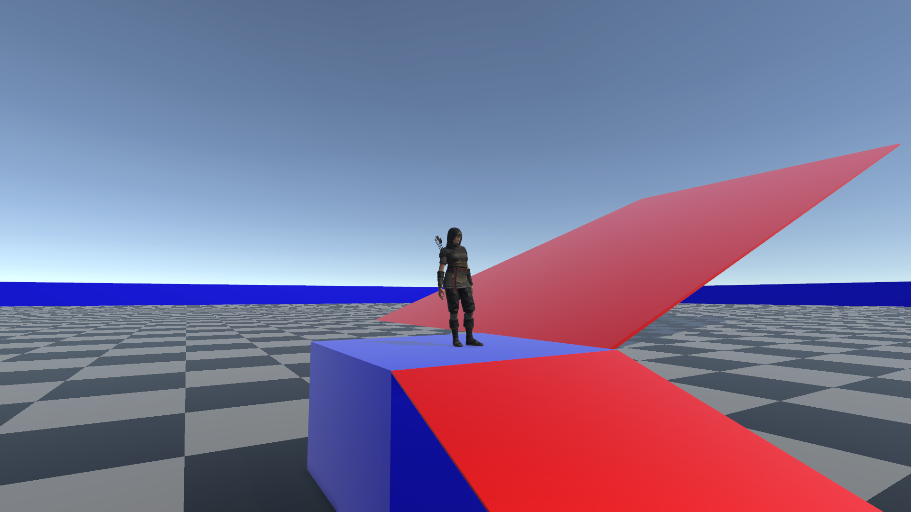

# _UNITY PARKOUR CLIMBING SYSTEM_

- **DESCRIPTION :**
  - **Course Unity Parkour & Climbing System**
  - **This project is for learning purposes only.**

---

- **CONTROLS :**
  - **Swap Scenes : `Space`**
  - **Zoom In : `Numeric Keypad +`**
  - **Zoom Out : `Numeric Keypad -`**
  - **Exit Game : `Escape`**
  - **Developer Mode : `Numeric Keypad 0`**

---

- **STACK :**
  - **UNITY PARKOUR CLIMBING SYSTEM** : `0.4.0`
  - **UNITY** : `2022.3.20f1`

---

- **CREDITS :**
  - **Author : [FANTAS666X](https://github.com/FANTAS666IXI)**
  - **Guide : [FANTACODE STUDIOS](https://www.udemy.com/user/fantacode-studios)**